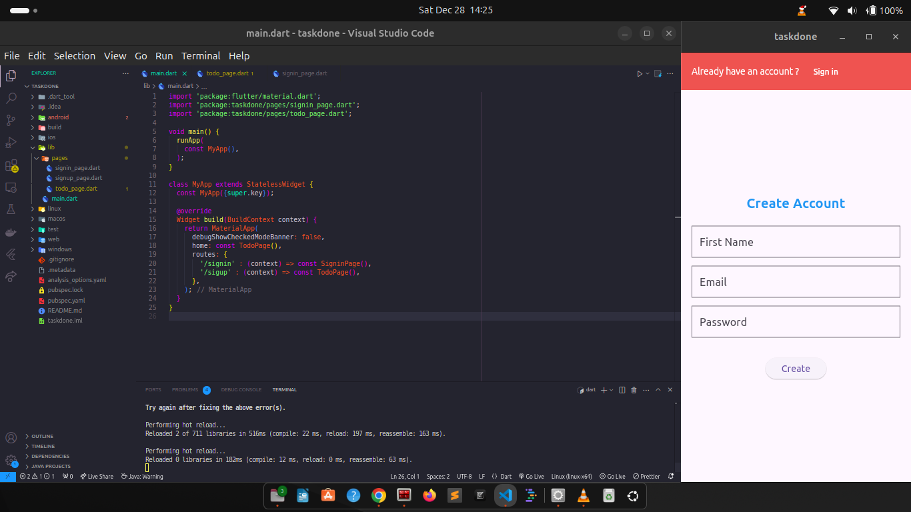

# Taskdone

A new Mobile UI/UX

## Getting Started

This project is a basic ui/ux mobile app onboarding screen for a usual user sign-up and a signin page.

Reated by yours truely Tonye Waribo

- email: waribosamuel@gmail.com
- phone: +2348066906845
- jobs: Available for full time mobile developer role [Flutter]
- this is an open source project and free to be used by anyone

